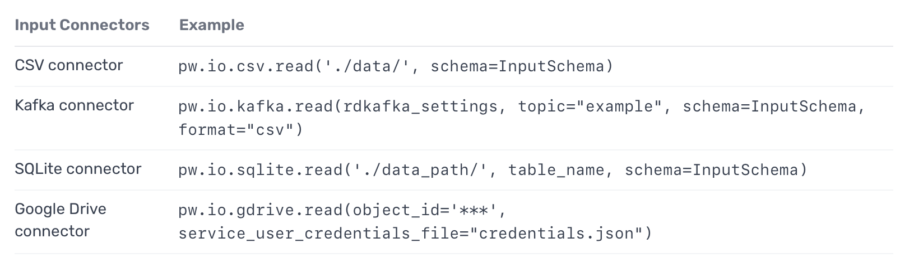
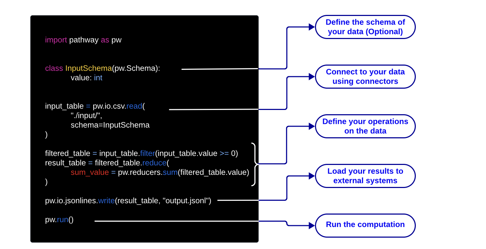
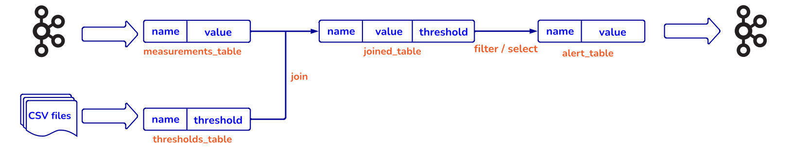

# Pathway Installation Guide

## Overview
This is the inhouse pathway guide for interIIT tech 

## Installation Methods

### 1. Using Conda (macOS, Linux & WSL)

To install Pathway using Conda, follow these steps:

1. **Create a Conda Environment**:
   Open your terminal and run:
   ```bash
   conda create -n pathway_env python=3.10
   ```

2. **Activate the Environment**:
   ```bash
   conda activate pathway_env
   ```

3. **Install Pathway**:
   Run the following command to install Pathway:
   ```bash
   pip install -U pathway
   ```

### 2. Using Docker (Any OS)

If you prefer to use Docker, follow these instructions:

1. **Pull the Docker Image**:
   Open your terminal and run:
   ```bash
   docker pull pathwaycom/pathway:latest
   ```

2. **Run the Docker Container**:
   To start the container and access the shell, use:
   ```bash
   docker run -it --entrypoint /bin/bash pathwaycom/pathway:latest
   ```
## Helpful Commands

- **Activate Conda Environment**:
  ```bash
  conda activate pathway_env
  ```

- **List Installed Packages in Conda**:
  ```bash
  conda list
  ```

- **Exit Docker Container**:
  Type `exit` or press `Ctrl + D`.

---
## Input Connectors 


## Basic example fort running 


### How to join filter and ETL
Apache Kafka is used for realtime data streaming and messaging so we can integrate it using pathway 

like given below is the example how to connect a CSV file to Apache Kafka

```bash 
rdkafka_settings = {
# add your setting here
}

#accesing measurments using Kafka
measurements_table = pw.io.kafka.read(
    rdkafka_settings,
    topic="topic",
    schema=MeasurementSchema,
    format="json",
    autocommit_duration_ms=1000
)
joined_table = measurements_table.join #using this command to join the table

# Sending the results to another Kafka topic, on the same Kafka instance

pw.io.kafka.write(alerts_table, rdkafka_settings, topic_name="alerts_topic", format="json")
```


Above is the given example is the sheet how the process flow work for realtime datastreaming 


